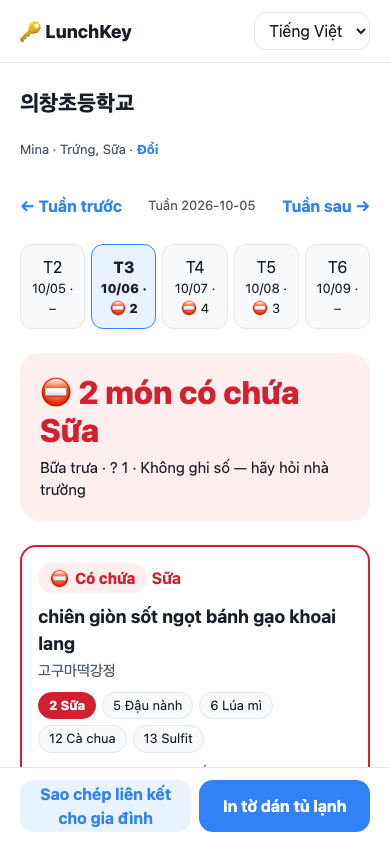
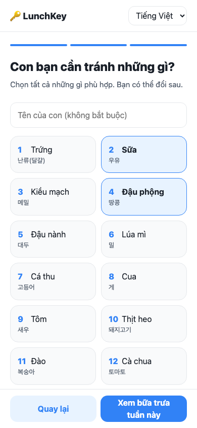
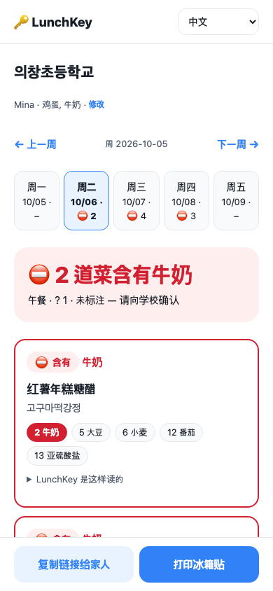

# LunchKey 🔑

[](https://github.com/Ryugi62/lunchkey/actions/workflows/test.yml)

**Korean school lunch menus mark allergens with bare numbers: `새알심만두국 (1.2.5.6.9.10.15.16.18)`. LunchKey turns the live menu of any Korean school into a per-child view in the parent's own language. Each dish is shown as ⛔ contains your child's allergen, ✓ no listed allergen, or ? not labeled.**

Live: **https://ryugi62.github.io/lunchkey/** · one-click sample: https://ryugi62.github.io/lunchkey/?demo=1 (Vietnamese: `?demo=1&lang=vi`)
No login, no server, no cost. Built for WarriorHacks 2.0 (theme: *solve an issue in your community, county, state, or nation*).

<p>
  
  
  
</p>

## The problem

- South Korea has **202,208 multicultural K-12 students, 4.0% of all students**, a record high and still rising ([2025 Education Statistics, KEDI](https://www.kedi.re.kr/khome/main/announce/selectBroadAnnounceForm.do?selectTp=0&board_sq_no=3&article_sq_no=36108)). Many of their parents grew up in Vietnam, China, the Philippines, Japan, or Central Asia and do not read Korean well.
- Food allergy is common at school age. In a survey of 27,679 Korean students (2012), **6.8% had a doctor-diagnosed food allergy** and 7.6% had a reaction in the past year ([Allergy Asthma Respir Dis](https://synapse.koreamed.org/upload/synapsedata/pdfdata/0206aard/aard-1-227.pdf)).
- Every school publishes its menu through the national NEIS system, but **only in Korean, with allergens as numbers 1–19**. Parents get a one-page legend at the start of term. To check one day for one child, a parent has to read each Korean dish name, find its numbers, look each one up, and compare them with their child's list. That is about 7 dishes a day, 5 days a week, in a second language.

A parent who can't read the menu can't do what the school expects every parent to do: check the menu and tell their child what to skip.

## What it does

1. **Pick your language**: English, Tiếng Việt, 中文, Filipino, 日本語, Русский or 한국어.
2. **Find the school**: search by its Korean name (copy it from any school notice). The menu is fetched live from the Ministry of Education's open API.
3. **Pick what your child must avoid** from the 19 numbered allergens. Each is shown in your language with the Korean word underneath.
4. **See the week.** Each day's tab shows ⛔ and a count, or ✓. Each dish shows its verdict, an explanation of the dish name, and every allergen number decoded, with your child's ones in red.
5. **Print a fridge sheet** (one page, your language) or **copy a family link**. The child's profile travels in the link's `#hash`, which is never sent to any server.
6. **Paste a menu** from a daycare or kindergarten, or a photo you typed out. These use the same numbers and the same checker.

### Three verdicts, one rule: never say "clear" without evidence

| Verdict | When | Why |
|---|---|---|
| ⛔ **Contains** | a printed number matches your child's allergen | always wins, even if other numbers on the line are unreadable |
| ✓ **No listed allergen** | numbers are printed and none match | "listed" is the honest claim: we read what the school printed |
| ? **Not labeled, ask the school** | no number printed, or a number outside 1–19 | we can't tell, so we never show these as clear |

## Does it actually read real menus? (measured, not claimed)

`npm run audit` samples real lunches from **all 17 provincial education offices**. Latest run (Sep 2026 lunches, run 2026-10-06):

| | |
|---|---|
| Schools sampled / with menus | 170 / 140 |
| Lunches · dish lines | 2,850 · **18,850** |
| Dish lines with allergen numbers that were parsed into valid codes | **100%** (0 malformed, 0 leftover digits) |
| Menu "variant tags" correctly *not* read as allergens (`호박죽-1`, `공통양념-2`) | 320 lines |
| Dish names fully explained from the reviewed word list | **86.4%** (partially 13.2%, none 0.4%) |

Raw output: [`docs/audit.json`](docs/audit.json). The 120-line hand-check sample is in [`docs/audit-sample.json`](docs/audit-sample.json).
**What the hand check found:** in the first run, 1 of 120 lines was wrong. `공통양념-2` ("common seasoning #2") had been read as allergen 2 (milk). It is now a variant tag, with a regression test. Earlier, `부대찌개1 (…)` and `호박죽-1 (…)` taught the parser the same lesson.

### Dish names: explained, not machine-translated
A wrong translation of a dish name could hide an ingredient. So LunchKey builds each name only from a **reviewed glossary of 470+ Korean menu words** (English, Vietnamese, Chinese), using longest-match segmentation. For example, `돼지고기김치찌개` becomes pork + kimchi + stew. Any part it doesn't know is shown in Korean romanization and marked, never guessed. The allergen verdict never depends on the dish name. It comes from the printed numbers only.

## How it's built

```
src/domain/       allergens (19, 7 languages) · menu parser · verdict · gloss · romanize   — pure, no I/O
src/application/  weekView · pasteView                                                    — pure, depends on domain
src/adapters/     neis (fetch injected, keyless 5-row paging, retry) · profileStore (#hash) — I/O
src/ui/           app.js (composition root) · i18n (7 languages) · styles
scripts/          audit.mjs (national sample) · check-layers.mjs
```

- **Zero dependencies, no build step**: plain ES modules on GitHub Pages, so it costs nothing to keep running after the hackathon. The NEIS API is free, keyless for small queries, and has CORS open.
- **Tests: 32** (`npm test`, Node's built-in runner). They cover every acceptance criterion in [`SPEC.md`](SPEC.md), plus a layer rule: `domain/` and `application/` never import adapters or the UI.
- **Accessibility**: every verdict uses an icon, a word and a color, never color alone. Each language block gets a `lang` attribute so screen readers switch voice. Controls have labels and tap targets are at least 44 px. Pages fit 390 px with no horizontal scroll. Dark mode is supported.
- **Privacy**: no accounts, no analytics. The profile stays in `localStorage` and in the share link's hash.

Run locally: `npm test` · `npm run audit` · `npm run serve` then open http://127.0.0.1:4321

## Limits (honest)

- LunchKey reads the **19 allergens that Korean school menus number**. It cannot see ingredients a school didn't number, and it is **not medical advice**. The app says so on every screen and points parents to the school's nutrition teacher.
- School search needs the Korean school name, which parents usually have from school notices.
- Dish-name explanations cover about 86% of lines fully. The rest show romanized Korean for the unknown part.
- I have not run a user study yet. The next step is to try it with multicultural family support centers in Changwon.

## Why me, why here

I study in Changwon, an industrial city in South Gyeongnam with a large migrant-worker and multicultural-family population. The "community" in the theme is mine: a school menu is the same in every one of the 17 provinces, so one tool works nationwide.

## Disclosure

Built solo by Taegeol Kim (undergraduate, Changwon National University) with AI coding assistance (Claude). Every number above is produced by scripts in this repo and can be re-run.

License: MIT · Data: NEIS Open API, Korean Ministry of Education.
